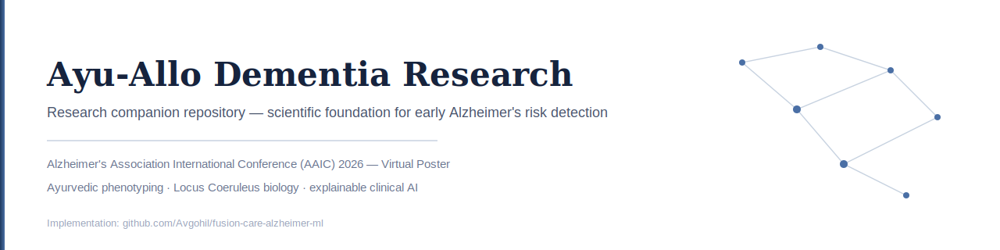
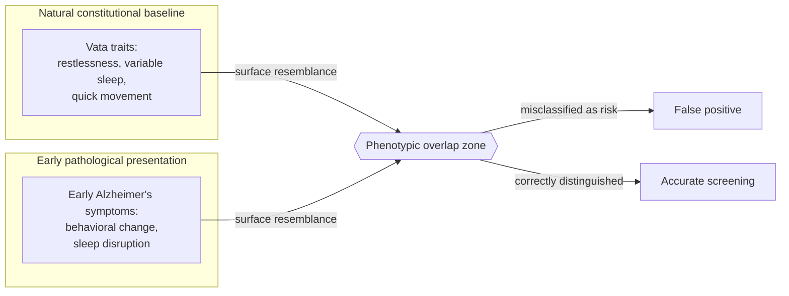
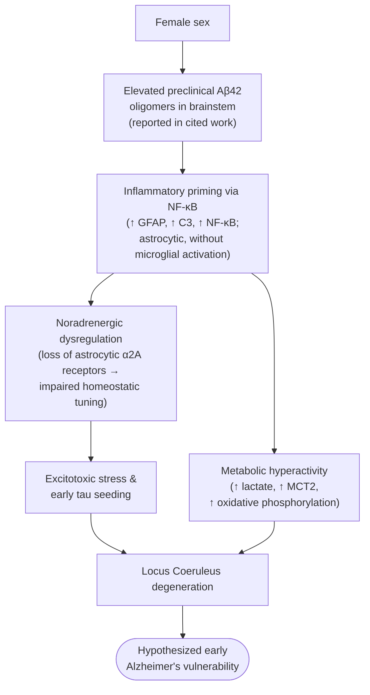
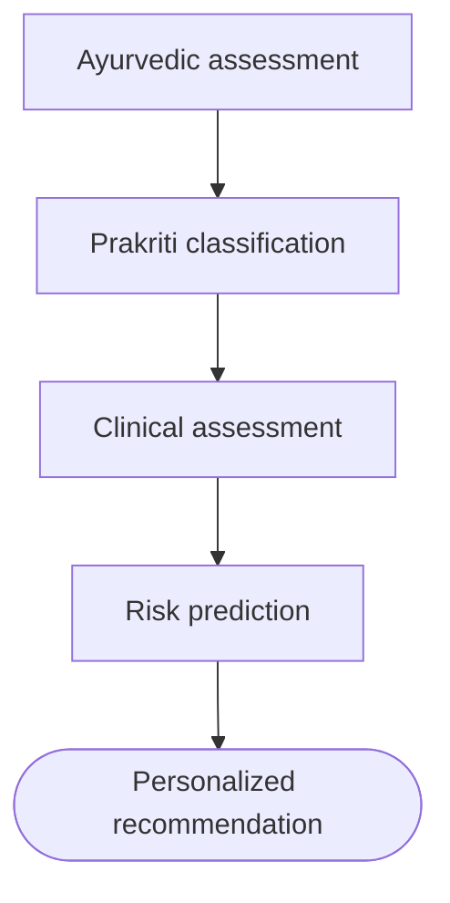
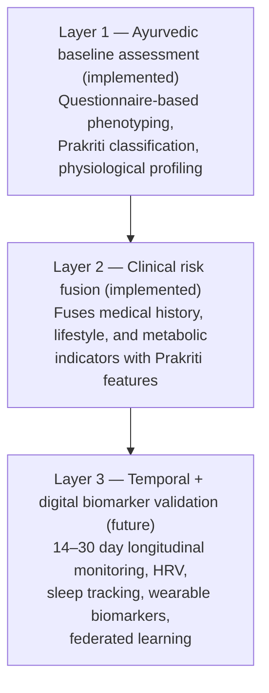
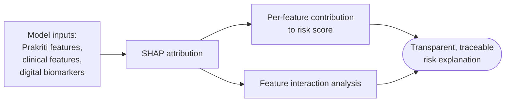
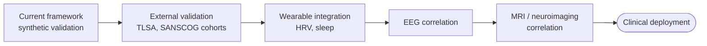
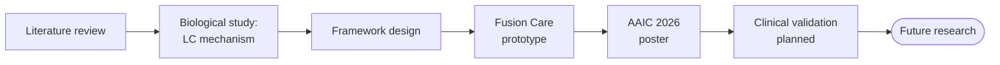
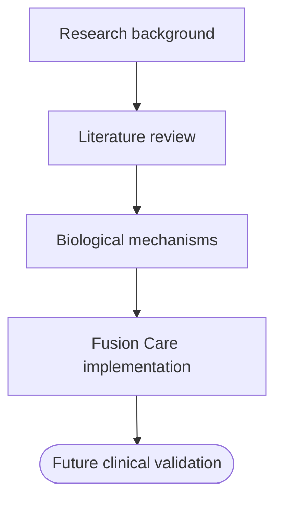
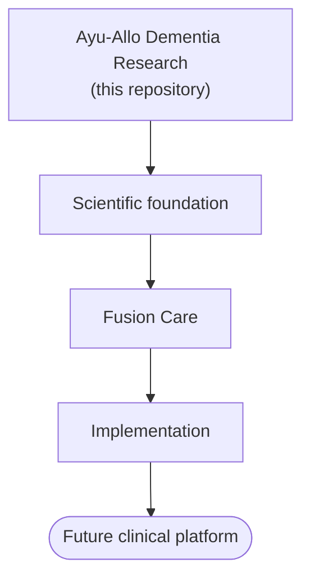

<p align="center">
  
</p>

# Ayu-Allo Dementia Research

A research companion repository for a two-stage AI/ML framework integrating Ayurvedic constitutional phenotyping with clinical and digital biomarker data for early (Stage-0) Alzheimer's disease risk detection.

**Repository type:** Research companion (literature, scientific background, conference materials, roadmap). Source code and the working prototype live in the implementation repository: [Fusion Care](https://github.com/Avgohil/fusion-care-alzheimer-ml).

<p align="left">
  
  
  
  
  
</p>

## Research Summary

This repository contains the scientific foundation for the Fusion Care framework: the literature and background motivating it, the biological mechanism informing its design, the AAIC 2026 poster and abstract, and the research roadmap for clinical validation. It does not contain source code, models, or an API — that implementation is maintained separately so that engineering changes and scientific documentation can evolve independently.

| Category | Details |
|---|---|
| Presented at | Alzheimer's Association International Conference (AAIC) 2026 |
| Presentation type | Virtual poster (Poster ID: P1-001) |
| Author | Ankita Vineshbhai Gohil, Computer Science Engineering, Parul University, Vadodara, India |
| System scope | Early risk stratification screening tool — not a diagnostic system |
| Current validation | Synthetic data; end-to-end pipeline feasibility demonstrated |
| Implementation | [Fusion Care](https://github.com/Avgohil/fusion-care-alzheimer-ml) |

## Conference Recognition

**Presented at the Alzheimer's Association International Conference (AAIC) 2026**

**Title:** *A Two-stage AI/ML Framework Integrating Ayurvedic Phenotyping and Clinical Data for Early Alzheimer's Risk Detection*

## Abstract

Early detection of Alzheimer's disease remains difficult in South Asian populations, where access to advanced diagnostics is limited and cognitive symptoms are often presented late. This work proposes a culturally contextualized AI/ML framework that integrates Ayurvedic constitutional phenotyping (Prakriti) with clinical and digital biomarker data to support early, low-cost risk stratification for Stage-0 dementia. A two-stage pipeline first classifies constitutional type from an Ayurvedic questionnaire, then fuses that classification with clinical and lifestyle features in a risk prediction model. The framework is further motivated by evidence of female-biased Locus Coeruleus vulnerability in early Alzheimer's pathology, which informs feature weighting in the clinical stage. Prototype validation on synthetic data demonstrates architectural feasibility; real-world clinical validation is planned future work.

## Key Takeaways

- **Integrative design** — combines Ayurvedic phenotyping, clinical screening, and digital biomarkers in a single pipeline
- **Scalable screening** — demonstrates technical feasibility for Stage-0 dementia risk stratification at low cost
- **LC-centric perspective** — centers early vulnerability of the Locus Coeruleus, one of the first regions affected in Alzheimer's disease
- **Target setting** — designed as a low-cost screening pipeline for resource-limited settings, not a replacement for clinical diagnosis
- **System scope** — classifies early risk profiles; explicitly not a final diagnostic tool

## Introduction

Ayurveda offers long-standing frameworks for individual physiological characterization — Prakriti-based constitutional profiling and Nadi (pulse) assessment — that capture subtle physiological and behavioral variation, potentially preceding clinical impairment. These frameworks have rarely been integrated with modern AI/ML-based clinical assessment. This repository documents the research case for doing so, and the biological and methodological reasoning behind the resulting framework.

## Research Motivation

Alzheimer's disease is typically diagnosed after significant neurological damage has already occurred. In South Asian populations specifically, limited access to advanced diagnostic infrastructure compounds this: cognitive symptoms tend to present late, and there is no existing pipeline that combines traditional constitutional assessment with clinical screening in a systematic, computational way. A low-cost, culturally grounded screening layer — used alongside, not instead of, clinical diagnosis — has value even before it reaches diagnostic-grade accuracy, simply by identifying who should be referred for further evaluation earlier than they otherwise would be.

## Research Gap

Current early-screening approaches cannot reliably distinguish between an individual's **natural constitutional baseline (Prakriti)** and a **pathological deviation from that baseline (Vikriti)**. Without that distinction, systems risk treating a person's ordinary constitutional traits as symptoms.

The core challenge is threefold: a lack of baseline personalization (comparing individuals to population norms rather than their own baseline), a lack of multimodal fusion between constitutional and clinical data, and a lack of privacy-preserving learning approaches suited to sensitive health screening.

This motivates the need for an integrative, scalable, culturally contextualized framework fusing Ayurvedic phenotyping with clinical and digital biomarkers for Stage-0 dementia risk detection.

## Background

Prakriti is a constitutional typing system describing an individual's baseline physiological and behavioral tendencies across three doshas — Vata, Pitta, and Kapha — determined largely at birth and relatively stable across the lifespan. Vikriti describes a deviation from that baseline brought on by illness, stress, aging, or pathology. The distinction between the two is central to this project's screening logic, detailed below.

## Phenotypic Overlap



Some Prakriti traits and some early Alzheimer's symptoms present similarly on the surface: a Vata-dominant individual's natural restlessness and sleep variability can resemble the early behavioral symptoms of Alzheimer's disease. Without a way to separate the two, a screening model risks systematically over-flagging individuals whose natural constitution happens to overlap with early pathological presentation — increasing false positives specifically among people whose baseline, not their health trajectory, resembles risk. Distinguishing Prakriti from Vikriti is therefore a precondition for a usable screening signal, not an incidental detail.

## Why Ayurveda?

Prakriti-based constitutional assessment is inexpensive, requires no laboratory infrastructure, and has been used as a diagnostic framework for centuries. As a phenotypic layer, it offers a way to characterize individual variability that conventional clinical intake does not capture. This project treats it as a complementary signal to be tested computationally alongside clinical data — not as a validated biomarker for Alzheimer's risk in its own right. That validation is a matter for future clinical study, not a claim made here.

## Why Clinical AI?

A constitutional signal alone cannot support a risk assessment; it needs to be fused with clinical and lifestyle indicators (age, family history, cardiovascular and metabolic markers, cognitive self-report) that have established relevance to Alzheimer's risk. Machine learning provides the mechanism for combining a categorical constitutional signal with continuous and categorical clinical features into a single, interpretable risk score. The value of AI here is fusion and pattern recognition across heterogeneous input types, not automated diagnosis.

## Molecular Mechanism

### Female-Biased LC Vulnerability: Scientific Background

This subsection summarizes emerging neuroscience findings that motivate part of this project's research direction. It is background literature, not a mechanism established, tested, or experimentally validated by this project.



Recent neuroscience research presented by researchers at the Centre for Brain Research (Indian Institute of Science) at the FENS Forum 2026 describes a candidate pathway for sex-biased vulnerability of the **Locus Coeruleus (LC)** — one of the earliest brain regions implicated in Alzheimer's disease pathology. The proposed pathway, as reported in that work, links an elevated preclinical female burden of Aβ42 oligomers to NF-κB-mediated inflammatory priming, noradrenergic dysregulation, excitotoxic stress, early tau seeding, and metabolic hyperactivity, converging on earlier LC degeneration.

**This project's relationship to this research is limited to motivation, not implementation.** The mechanism above is presented here as scientific background informing why sex-stratified analysis is a direction worth investigating in future work on this framework — it is not a mechanism this project has tested, validated, or built into the current Fusion Care implementation. No component of the current two-stage pipeline models, measures, or depends on the biological pathway described above.

Should future versions of this framework incorporate biological-sex-stratified modeling, that work would need its own independent validation and is not represented as already accomplished by this repository or by Fusion Care. Readers interested in the primary neuroscience findings should consult the original presentation (see References) rather than treating this summary as a substitute for the source material.

## Two-Stage Framework



Stage 1 (Ayurvedic assessment → Prakriti classification) establishes constitutional baseline. Stage 2 (clinical assessment → risk prediction) fuses that baseline with clinical and lifestyle features to produce a risk score and a corresponding recommendation. Implementation detail for both stages — questionnaire structure, feature encoding, model architecture — is maintained in the [Fusion Care](https://github.com/Avgohil/fusion-care-alzheimer-ml) repository; this repository documents the research rationale for the framework's structure.

## Tri-Layer Validation Strategy



**Layer 1 — current implementation.** Questionnaire-based Prakriti classification and baseline physiological profiling, as implemented in Fusion Care today.

**Layer 2 — clinical integration.** Fusion of medical history, lifestyle, and metabolic indicators with Prakriti features to improve personalized risk stratification, also implemented in the current prototype.

**Layer 3 — future longitudinal validation.** Planned extension to 14–30 day temporal baseline calibration, wearable-derived digital biomarkers (HRV, sleep tracking), and federated learning so that no raw health data leaves the device.

## Explainable AI



A risk score is only useful in a healthcare context if its contributing factors are visible to the person receiving it and to any clinician reviewing it. The framework's explainability approach is built on SHAP (Shapley Additive Explanations): standardized per-feature attribution values quantify how much each input — a constitutional trait, a clinical marker, a digital biomarker — pushed an individual's risk score higher or lower. This supports two things a black-box score cannot: interaction analysis (surfacing cases where two features combine to produce a disproportionate effect, such as a Vata baseline combined with a nighttime HRV drop) and clinical transparency (giving a referring clinician a traceable rationale rather than an opaque number).

## Current Findings

Current validation uses **synthetic data** and demonstrates:

- Successful end-to-end execution of the two-stage pipeline
- Stable risk stratification across simulated cohorts
- Improved segmentation from Prakriti features relative to a clinical-only baseline
- Reduced false positives from tri-layer validation, specifically addressing the phenotypic overlap problem
- Identification of dominant risk contributors via the explainability layer
- Architectural feasibility and internal logical consistency

**Limitation:** synthetic validation confirms feasibility, not clinical accuracy. Real-world clinical validation is future work, not a current result.

## Future Validation

External validation is identified as a future research direction, envisioned to draw on collaboration with research groups such as the Center for Brain Research, the AD Data Initiative, and Microsoft Research India, and to make use of existing cohort studies such as:

- **TLSA** (Srinivaspura Aging Study) — rural Karnataka cohort
- **SANSCOG** (Srinivaspura Longitudinal Cognitive Aging Study) — urban Bengaluru cohort

No formal collaboration with these groups or access to these cohorts has been established at this stage; they are named here as the intended direction for future validation, not as current partners or data sources. Available multi-modal data types referenced by these cohorts — MRI, OCT retinal imaging, gait metrics, cognitive testing, proteomics, genomics, and blood biomarkers — illustrate the kind of multi-modal validation this framework would need, should such collaboration be established. Planned future integrations include wearable HRV and sleep tracking, digital Nadi analytics, EEG, and multimodal longitudinal validation.

## Research Roadmap



## Research Timeline



## Conference Materials

The AAIC 2026 poster is the primary source document underlying this repository's scientific content. Rather than reproducing the poster itself, the material above — phenotypic overlap, molecular mechanism, two-stage framework, tri-layer validation, explainable AI — has been redrawn as original diagrams specific to this repository. The full poster PDF is included in this repository for reference and citation.

## Implementation Repository

This repository documents the scientific foundation — literature, mechanism, poster, and roadmap. The working prototype, including source code, trained models, the FastAPI backend, and API documentation, is maintained in a separate implementation repository:

**[Fusion Care](https://github.com/Avgohil/fusion-care-alzheimer-ml)** — Python, FastAPI, scikit-learn. Implements the two-stage pipeline described above: Prakriti classification (Stage 1) and clinical risk prediction (Stage 2).

## Research Ecosystem



## Repository Relationship



## Literature Review

The framework draws on prior work in digital biomarkers of cognitive function, computational approaches to Ayurvedic constitutional typing, and the broader Alzheimer's epidemiological literature. See References below for specific sources; a fuller literature review is maintained as this research progresses.

## References

1. Alzheimer's Association (2026). *Facts and Figures.*
2. Centre for Brain Research, Indian Institute of Science.
3. Dagum, P. (2018). *Digital Biomarkers of Cognitive Function.*
4. Kurunji, V. (2022). *Ayurvedic Prakriti and Modern Physiology.*
5. IISc CBR AI Challenge for Healthy Brain Aging (2026).

## Citation

If this work informs your research, please cite the AAIC 2026 poster:

```
Gohil, A. V. (2026). A Two-stage AI/ML Framework Integrating Ayurvedic Phenotyping
and Clinical Data for Early Alzheimer's Risk Detection. Poster presented at the
Alzheimer's Association International Conference (AAIC) 2026. Poster ID: P1-001.
```

## License

This repository is provided for educational and research purposes. It does not constitute medical advice or a diagnostic tool. Consult qualified healthcare professionals for clinical decisions.

## Acknowledgements

- This work is scientifically motivated in part by neuroscience research on Locus Coeruleus vulnerability presented by researchers at the Centre for Brain Research, Indian Institute of Science, at FENS Forum 2026
- External validation in collaboration with research groups such as the Centre for Brain Research, the AD Data Initiative, and Microsoft Research India, along with cohort studies such as TLSA and SANSCOG, is identified as a future research direction rather than a confirmed partnership at this stage
- The Ayurveda community, for the constitutional frameworks this work builds on

---

If this repository contributes to your research or learning, consider citing the work or starring the repository. For source code and the working prototype, see the [implementation repository](https://github.com/Avgohil/fusion-care-alzheimer-ml).
